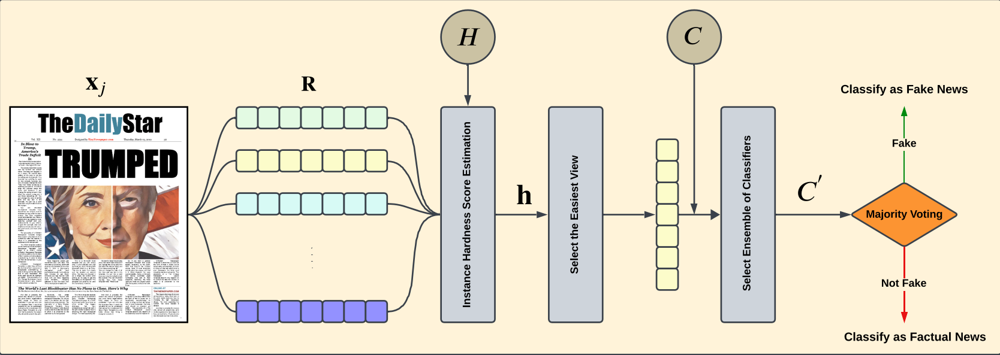

# Fake News Detection using Dynamic Multi-view and Ensemble Selection System (DMES)
The rapid spread of information via social media has made detecting fake news critically important due to its significant societal impact. This repository contains the implementation of a novel method, Dynamic Multi-view and Ensemble Selection (DMES), designed to improve the accuracy of fake news detection by using only text-based features. The DMES method adapts to multi-class challenges and overlapping classes, utilizing dynamic selection of both the most relevant textual representation (view) and the most competent ensemble of classifiers based on instance hardness scores. The key feature of DMES is its ability to handle the complexity of fake news detection through the combination of diverse textual feature representations and dynamic classifier selection. By estimating the classification difficulty (instance hardness) for each news article across various views, DMES significantly improves the robustness of fake news detection. This approach is highly flexible and can be extended to other domains requiring multi-view and ensemble selection methodologies.

