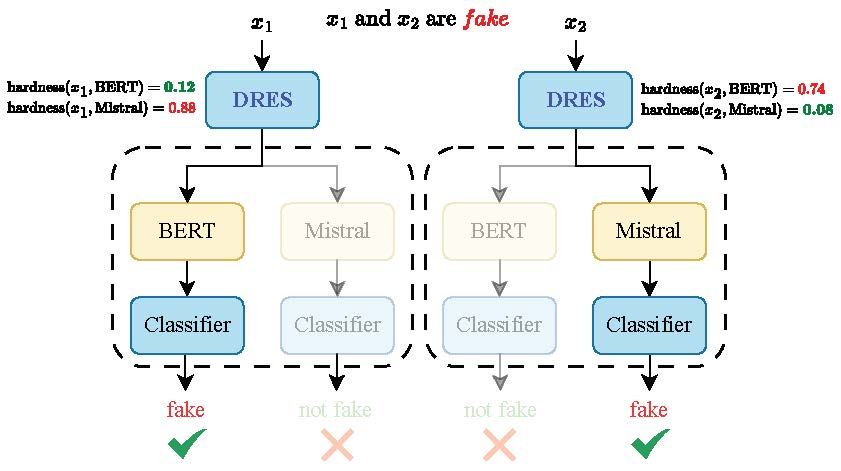

# DRES: Fake News Detection by Dynamic Representation and Ensemble Selection

[](https://openreview.net/forum?id=KunhAW4KWm)
[](LICENSE)
[]()
[](requirements.txt)

Official implementation of **DRES**, accepted for **Main Conference** at **EMNLP 2025 (oral presentation)**.
---


## Abstract
The rapid spread of information via social media has made text-based fake news detection critically important due to its societal impact. This paper presents a novel detection method called **Dynamic Representation and Ensemble Selection (DRES)** for identifying fake news based solely on text. DRES leverages **instance hardness measures** to estimate classification difficulty for each news article across multiple textual feature representations. By dynamically selecting both (i) the **textual representation** and (ii) the most competent **ensemble of classifiers** per instance, DRES significantly enhances prediction accuracy. Extensive experiments show that DRES achieves notable improvements over state-of-the-art methods, confirming the effectiveness of **representation selection + dynamic ensemble selection** in boosting performance.  

## Citation

If you use this code, please cite our paper:

```bibtex
@inproceedings{farhangian2025dres,
  title={{DRES}: Fake news detection by dynamic representation and ensemble selection},
  author={Faramarz Farhangian and Leandro Augusto Ensina and George D C Cavalcanti and Rafael M. O. Cruz},
  booktitle={The 2025 Conference on Empirical Methods in Natural Language Processing},
  year={2025},
  url={https://openreview.net/forum?id=KunhAW4KWm}
}

```
## Contributors

Thanks to the following people for their contributions:

<a href="https://github.com/FFarhangian">
  
</a>
<a href="https://github.com/Menelau">
  
</a>


